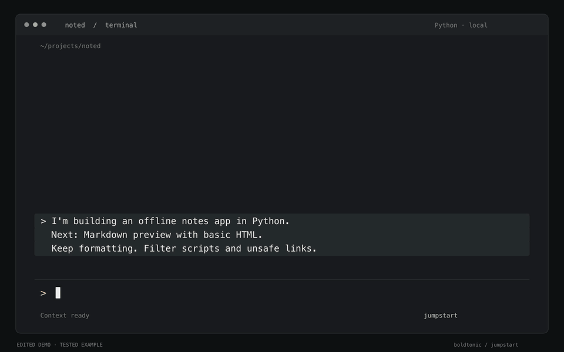
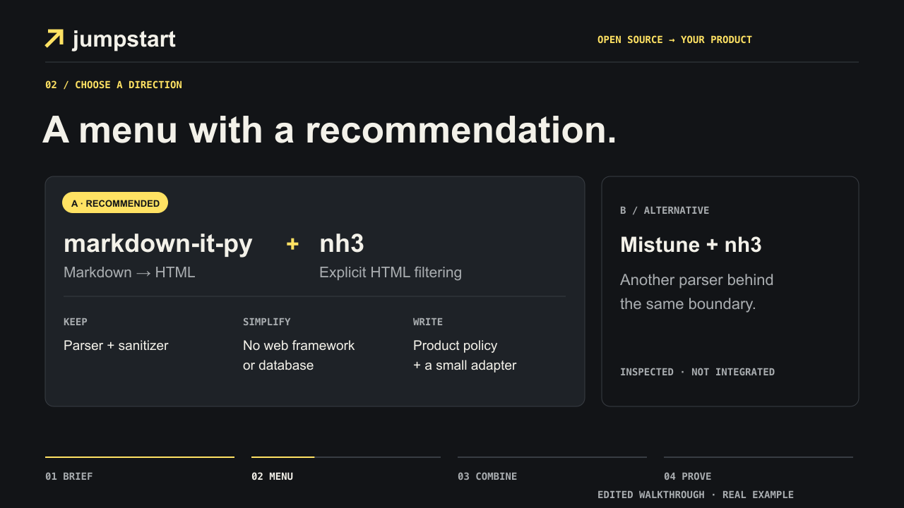
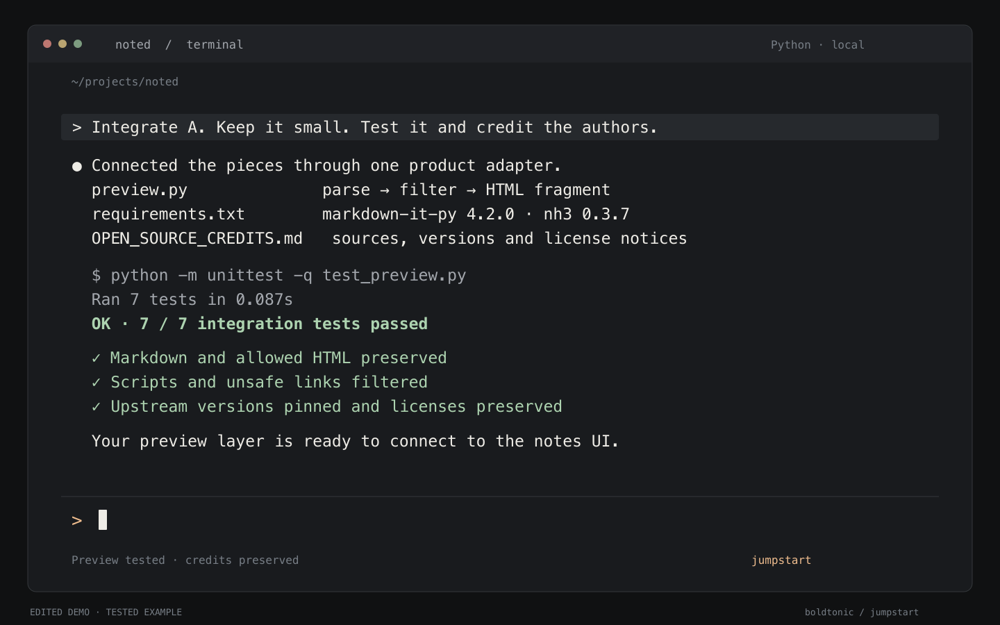

# Jumpstart ↗

**Vibecode your product with the right open-source foundations.**



[](LICENSE)
[](#install)
[](#install)
[](https://agentskills.io/specification)
[](mcp_server/README.md)
[](https://x.com/boldtonic)
[](https://www.linkedin.com/in/ferrullan/)

Jumpstart is a skill for your coding agent. Tell it what you're building and it goes looking for open-source projects that already solve the hard parts, reads their actual code, and comes back with a short menu: what to reuse, what to cut, what you still have to write, and how the pieces fit together. Pick a route and your agent builds it, tests it, and credits the people whose work you're building on.

Ask it things like:

- "/jumpstart I'm building a local-first app for audio interviews. What already exists?"
- "/jumpstart Read this project and find open-source pieces for document import."
- "/jumpstart Should we fork this app or compose smaller libraries?"
- "Integrate option A. Keep our UI, test the whole flow, credit the authors."

No hosted service. No extra API keys. Your agent, your model, public GitHub.

---

## What you get

- **A short menu, not a pile of links** — two or three routes, what each repo contributes, and what to keep, remove and write yourself
- **Evidence, not vibes** — code read at pinned commits, with documented, inspected and tested claims kept apart
- **Honest trade-offs** — the work you avoid, the maintenance you inherit, and the licenses that come with it
- **A working integration when you ask** — the chosen pieces wired in, tested, pinned and credited
- **Works where you already work** — Claude Code, Codex and other Agent Skills clients, plus an MCP server for MCP clients

---

## Install

```sh
npx skills add boldtonic/jumpstart -g
```

The installer asks which agents to install for and needs Node.js 22.20+. No Node? Copy the `skills/jumpstart` folder, or unzip [the skill ZIP](dist/jumpstart-skill.zip), into your agent's skills directory. For Claude Code that is `~/.claude/skills/jumpstart`.

| Where | How to use it |
|---|---|
| Claude Code | `/jumpstart` followed by your request |
| Codex | `$jumpstart` followed by your request |
| Other Agent Skills clients | The client's own skill invocation |
| MCP clients | [Connect the MCP server](mcp_server/README.md), then ask for Jumpstart |

Open a new session if your agent doesn't list it yet. The [compatibility record](evals/PORTABILITY.es.md) says what has actually been tested. Guía en español: [USO.es.md](USO.es.md).

---

## How it works

1. **Reads your context** — the conversation, project files, stack and constraints.
2. **Searches** GitHub, and package registries for libraries, with a few focused queries.
3. **Inspects** the promising candidates at pinned commits: boundaries, dependencies, tests and licenses.
4. **Hands you a menu** with one recommendation, and stops there until you choose.
5. **Integrates** the route you pick: smallest working slice first, tests on the connections, provenance and credits recorded.

Your agent supplies the model, the context and the coding tools. The research helper uses GitHub CLI (`gh`) and Python 3.9+; the MCP server needs Python 3.10+. Neither calls another model API or runs downloaded code. The MCP server runs locally (stdio or loopback HTTP); web-only clients would need a hosted deployment, which this project doesn't provide.

---

## A real combination

The [included Markdown previewer](examples/markdown_preview/README.md) combines two independent projects:

| Source | What we reuse | What our product owns |
|---|---|---|
| [markdown-it-py](https://github.com/executablebooks/markdown-it-py) | Markdown parsing and rendering | Supported content and parser configuration |
| [nh3](https://github.com/messense/nh3) | HTML sanitization | Allowed elements, attributes, and URL policy |
| Original adapter | The connection between them | File input/output, limits, and integration tests |





**Seven integration tests pass.** The [provenance report](examples/markdown_preview/OPEN_SOURCE_CREDITS.md) records the selected versions and preserved notices. This example composes libraries through their public APIs; it doesn't claim extraction of tightly coupled internals from large applications. The demo at the top is an edited reconstruction of this tested example: [source and evidence](demo/README.md).

---

## Development and credits

[Development guide](docs/DEVELOPMENT.md) · [Validation results](evals/RESULTS.md) · [Behavioral cases](evals/CASES.md) · [Design sources](DESIGN_SOURCES.md)

Original code is [MIT-licensed](LICENSE). Reused material keeps its [upstream notices](THIRD_PARTY_NOTICES.md). Jumpstart records attribution as part of integration, not as an afterthought.

Built by [@boldtonic](https://github.com/boldtonic). If Jumpstart helps you build something, share it, and consider leaving a star.
